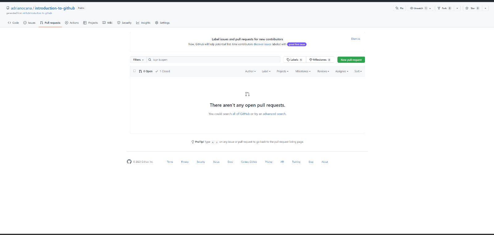

# UDGit A1. Introduction to GitHub
Realiza el siguiente curso diseñado por el equipo de formación de GitHub. Forma parte de un conjunto de cursos interactivos diseñados para principiantes en el uso de GitHub. Te introduce en el desarrollo colaborativo mediante GitHub: una herramienta de control de versiones. Trabajarás con un repositorio de prueba sobre el que realizarás unos pasos clave.

Entrega un pantallazo que demuestre que lo has finalizado y responde a las siguientes preguntas:

**1. Busca en Wikipedia e indica:** 

 1. Qué es GitHub y su relación con Git:

    GitHub es una forja (plataforma de desarrollo colaborativo) para alojar proyectos utilizando el sistema de control de versiones Git.
    Se utiliza principalmente para la creación de código fuente de programas de ordenador. El software que opera GitHub fue escrito en Ruby on Rails. Desde enero de 2010, GitHub opera bajo el nombre de GitHub, Inc. Anteriormente era conocida como Logical Awesome LLC. El código de los proyectos alojados en GitHub se almacena generalmente de forma pública.

 2. Compañía dueña de GitHub:
    Micorsoft es la empresa dueña de github.
   
**2.Qué es una rama en el código (branch of the code)**
Una rama es una versión paralela de un repositorio. Se incluye en del repositorio, pero no afecta a la rama primaria o principal, lo que te permite trabajar libremente sin interrumpir la versión "activa". Una vez que haya realizado los cambios deseados, puede volver a combinar la rama en la rama principal para publicarlos.
**3.Qué es una nueva característica en el código (new feature)**

 **4.Qué es un pull request**
 Los pull requests son la forma de contribuir a un proyecto grupal o de código abierto. Por ejemplo, un usuario llamado Harry realiza un fork de un repositorio de ThanoshanMV y le efectúa algunos cambios
 **5.Qué es un merge**
 La fusión es la forma que tiene Git de volver a unir un historial bifurcado. El comando git merge permite tomar las líneas independientes de desarrollo creadas por git branch e integrarlas en una sola rama. Ten en cuenta que todos los comandos presentados a continuación se fusionan en la rama actual.
 **6.Qué es un issue**
 Un Issue es una nota en un repositorio que trata de llamar la atención sobre un problema. Puede ser un error a corregir, una petición para añadir una nueva opción o característica, una pregunta para aclarar algún tema que no está correctamente aclarado o muchas otras cosas diferentes.
**7.Qué es una mención y qué implica**
Notificar a una persona en GitHub con "@" antes de su nombre de usuario. Los usuarios de una organización en GitHub también pueden formar parte de un equipo que se puede mencionar.
-notificaciones de inspección:
Una notificación sobre la actividad en un repositorio al que se ha subscrito un usuario.
-notificaciones por correo electrónico:
Las notificaciones enviadas a la dirección de correo electrónico de un usuario.
-notificaciones web:
Las notificaciones que se muestran en la interfaz web en GitHub: https://github.com/notifications

 **8.Qué es una etiqueta (label) y por qué su uso**
 Etiqueta en una incidencia o una solicitud de incorporación de cambios. Los repositorios incluyen una serie de etiquetas predeterminadas, pero los usuarios pueden crear etiquetas personalizadas.

 Puede administrar el trabajo en GitHub si crea etiquetas para categorizar incidencias, solicitudes de incorporación de cambios y debates. Puedes aplicar etiquetas en el repositorio en el que éstas se hayan creado. Una vez que existe una etiqueta, puede usarla en cualquier incidencia, solicitud de incorporación de cambios o debate dentro de ese repositorio.

 **9. Qué son las notificaciones. Indica las tres opciones de notificaciones**
 Actualizaciones que se entregan por la web o por correo electrónico, en función de la configuración, y que proporcionan información sobre las actividades que te interesan.
    
 **10. Qué son GitHub Pages**
 GitHub Pages es un servicio de alojamiento de sitio estático que toma archivos HTML, CSS y JavaScript directamente desde un repositorio en GitHub, opcionalmente ejecuta los archivos a través de un proceso de complilación y publica un sitio web.
 **11. Qué es GitHub Flow**
GitHub Flow se define como un sistema de flujo de trabajo que se centra en los procesos de ramificación y que permite realizar implementaciones regulares en los proyectos, contribuyendo así a garantizar la entrega continua. Esta herramienta se basa en ramas o branches que forman parte del flujo de trabajo diario.

